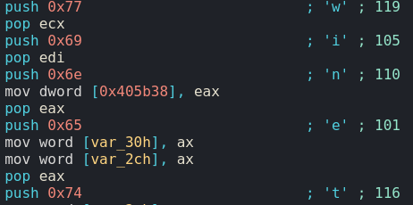

# Colibri Loader

Sample (SHA256): `1b2eaff481b083525a42635e86bbeb6ca0e7c1c9c3d880ba29754b9a2277b962`

URL: https://bazaar.abuse.ch/sample/1b2eaff481b083525a42635e86bbeb6ca0e7c1c9c3d880ba29754b9a2277b962/

---

## Notes

loads **libraries**:
- advapi
- wininet
- shell32
- user32
- shlwapi

library names are jumbled around stack strings:


these are assembled and `LoadLibraryW` is called to get a handle to the target library. Function addresses are then obtained as needed. These are also obfuscated/encrypted.


**Deobfuscates Strings** via this function:


For example function names as mentioned above and mutex name (see below).
This is the IP which is decoded: `188[.]130[.]139[.]47`

In memory:


Register:


Later, decodes a mutex name and calls CreateMutexW and GetLastError with check for 0xb7 -> checks if malware is already running.

Mutex Name `6rmUi1hRdfbvOQyXqa0T`:


Procmon:


Reaches 0x4045c2 which seems to be the main routine that establishes a connection to C2 server. 

routine 0x004046c0 decodes `/gate.php` and this:


Full Request:


decodes everything needed for GET request.


0x4040ce makes the HTTP request via:

1. InternetOpenW
2. InternetConnectW
3. HttpOpenRequestW
4. HttpSendRequestW

Using a netcat listener to catch the connection:


--- 

### IOCs

```console
IP: 188[.]130[.]139[.]47
Path: /gate.php/type=check&uid=
UID: 0F94C1C01E803234201734
Mutex: 6rmUi1hRdfbvOQyXqa0T
```


